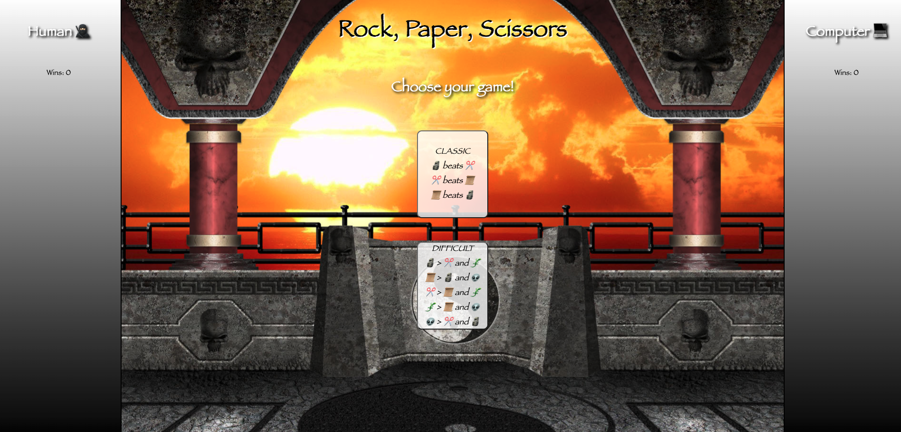

# Rock Paper Scissors
  
## Introduction
  This project was to create a rock paper scissors game that would rely on a user selection and a randomly generated computer selection to establish your 'fighters'. By creating both a player(player.js) and game(game.js) class, this project continued to build on our mod 1 fundamentals as we connected these data models to the DOM. The standard rock, paper, scissors version of the game can be started by clicking the classic button, or a difficult version of the game with five fighters can be started with a click  on its button.

The project spec & rubric can be found [here!](https://frontend.turing.edu/projects/module-1/rock-paper-scissors-solo-v2.html)

## Deployed Page
Visit the published [site!](https://Crpearce.github.io/rock-paper-scissors/)

## Features
  When you visit the site you will be greeted with the name of the game, two buttons giving the player the ability to choose their own difficulty, and two dynamic sides that will generate the players and win counter feater. Users can get the game going by clicking on the button for the game they would like to play.

  After a game choice has been made, the user is presented with a row of "fighters" that they can pick from. 
 
 
 The user choice is compaired to the randomly generated computer "fighter" choice and a win is tallied for the user with the winning icon.  
 
## Contributors
This website was built by a front end engineering student with the [Turing School of Software and Design](https://turing.edu/). 
  - [Colby Pearce](https://github.com/Crpearce)
## Possible Future Extensions
   
## Technologies
  - Javascript
  - HTML
  - CSS
## Sources
  - [MDN](http://developer.mozilla.org/en-US/)
  - [YouTube](https://www.youtube.com/)
  - [W3Schools](https://www.w3schools.com/)
